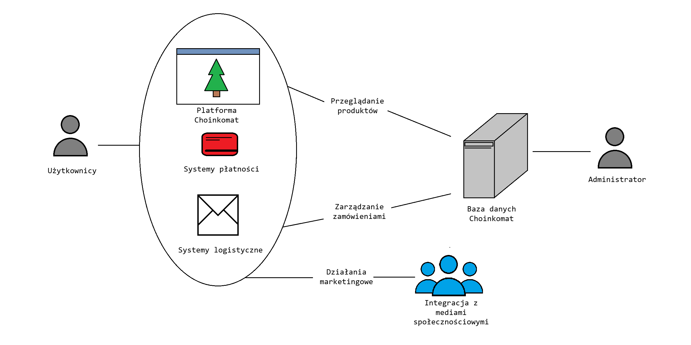

<h1 align="center">CHOINKOMAT</h1>

  

## Table of Contents
- [Version History](#version-history)
- [General Information](#general-information)
  - [System Description](#system-description)
  - [Target Audience](#target-audience)
  - [Expected Business Benefits](#expected-business-benefits)
- [Business Processes](#business-processes)
  - [BP01: Online Sales Process](#bp01-online-sales-process)
- [Actors](#actors)
- [Business Objects](#business-objects)
- [Functional Requirements](#functional-requirements)
  - [Modules](#modules)
  - [User Stories](#user-stories)
- [Non-Functional Requirements](#non-functional-requirements)
- [Context Diagram](#context-diagram)

## Version History

| Version | Date Created | Last Modified | Authors |
|---------|--------------|---------------|---------|
| 1.1     | 29.04.2024   | 04.05.2024    | Jakub Górski, Krzysztof Pyrski, Marcel Radtke, Bartosz Rakowski |

## General Information

### System Description
"Choinkomat" is an innovative web application platform focused on the distribution of Christmas trees and a wide variety of plants. The system facilitates both online and in-store purchases at local branches, offering a diverse range of products from standard Christmas trees to exotic plants. Additionally, the application provides product customization upon customer request, enabling unique shopping experiences.

### Target Audience
The primary audience includes individual customers interested in purchasing plants for decorative purposes, as well as corporate procurement teams seeking reliable suppliers for trees and plants for offices or corporate events. The platform also aims to attract plant enthusiasts by offering rare species and specialized products.

### Expected Business Benefits
Key business benefits include market reach expansion through unique products and customization, which should attract a broader customer base. The loyalty system enhances customer retention through discount and reward programs. Additionally, the digital monitoring of ordered plants increases customer trust and satisfaction.

## Business Processes

### BP01: Online Sales Process
The online purchasing process consists of several stages, starting from registration and login, product selection, personalization, payment, and delivery method selection. The system ensures continuous communication with the customer at every stage of the process, from order confirmation to delivery updates.

## Actors

- **User**: Has full autonomy in browsing the product range, making purchases, and managing their profile. They can also collect loyalty points and redeem them for discounts.
- **Administrator**: Responsible for managing platform content, updating the product range, processing orders, and overseeing the smooth operation of the entire system.

## Business Objects

- **Product**: Each product is characterized by unique attributes such as price, availability, customization options, and specific care requirements.
- **Transaction**: Documentation of each transaction includes all purchase details, such as product specifications, customer data, total purchase amount, and chosen payment and delivery methods.

## Functional Requirements

### Modules

**User Module (U)**
- **U01**: Registration and login with email confirmation, ensuring data security and privacy.
- **U02**: Full user profile customization, including adding a profile picture and managing payment methods.
- **U03**: Intuitive interfaces for browsing the product range, managing the cart, and completing purchases.

**Administrator Module (A)**
- **A01**: Store assortment management, including adding, editing, and deleting products.
- **A02**: Order handling, including monitoring order status and managing returns and complaints.
- **A03**: User account management, including assigning permissions and managing access.

### User Stories
- **As a user**, I want to easily register and log in so that I can quickly start shopping.
- **As a user**, I want to browse products, customize them, and make purchases from home to enjoy the convenience of online shopping.

## Non-Functional Requirements
- **NFR01**: Security - the system requires strong passwords and offers encryption for sensitive data.
- **NFR02**: Performance - the system guarantees short response times and high availability even under heavy load.
- **NFR03**: The system must be optimized for use on various mobile and desktop devices.

## Context Diagram

---

Feel free to contribute or raise issues regarding the project. For more detailed documentation and updates, visit our [repository](link_to_repository).
